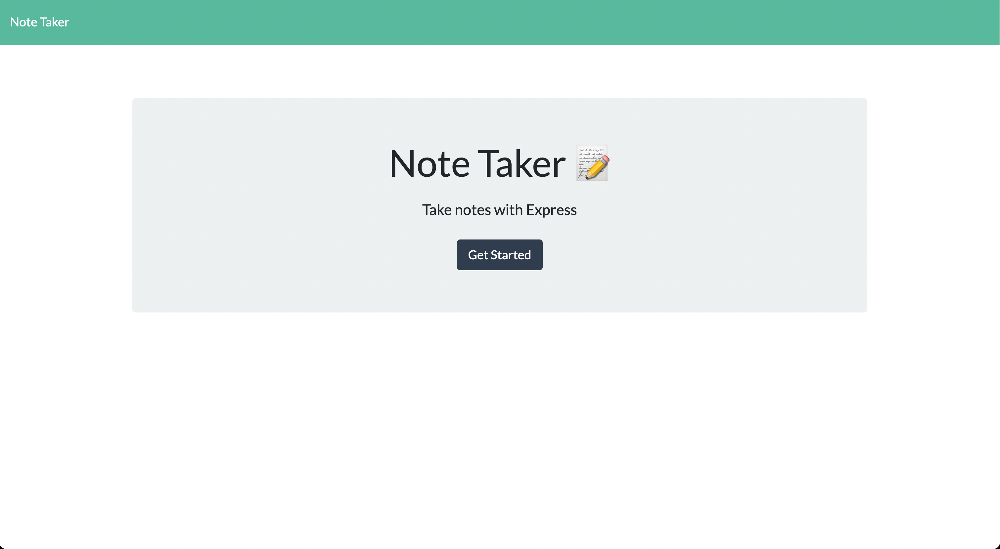
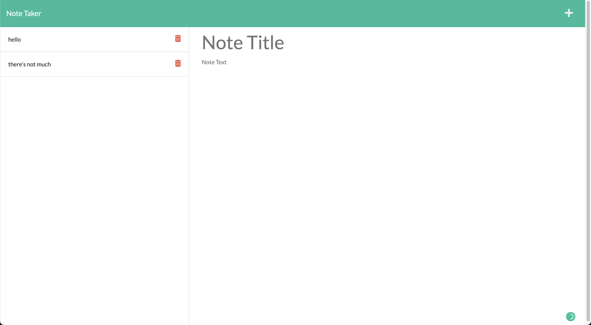

# Note-Taker

  This is a simple note-taker app. Not many other feature other than taking notes and deleting it.

  [](https://opensource.org/licenses/MIT)

---

## Contents 🗒
1. [User Story](#user%20story)
    1. [Acceptance criteria](#acceptance%20criteria)
    2. [Project Preview](#project%20preview)
2. [Installation](#installation)
3. [Technologies](#technologies)
4. [License](#license)
5. [Contributing](#contributing)
6. [Authors and acknowledgment](#authors%20and%20acknowledgment)
7. [Contacts](#contacts)

---

## User Story 👩🏻‍🏫

```
AS A small business owner
I WANT to be able to write and save notes
SO THAT I can organize my thoughts and keep track of tasks I need to complete
```

---

## Acceptance Criteria 🌈

```
GIVEN a note-taking application
WHEN I open the Note Taker
THEN I am presented with a landing page with a link to a notes page
WHEN I click on the link to the notes page
THEN I am presented with a page with existing notes listed in the left-hand column, plus empty fields to enter a new note title and the note’s text in the right-hand column
WHEN I enter a new note title and the note’s text
THEN a Save icon appears in the navigation at the top of the page
WHEN I click on the Save icon
THEN the new note I have entered is saved and appears in the left-hand column with the other existing notes
WHEN I click on an existing note in the list in the left-hand column
THEN that note appears in the right-hand column
WHEN I click on the Write icon in the navigation at the top of the page
THEN I am presented with empty fields to enter a new note title and the note’s text in the right-hand column
```

---

## Project Preview 📸




---

## Installation 📀

  If you want to make changes, feel free to clone

  To clone the repo:

    git clone 
    
    git@github.com:vynguyen205/Note-Taker.git

---

## Technologies 👩🏻‍🔧

- JavaScript (React.js and Node.js), HTML, CSS

---

## License 👮🏻‍♀️

  License used for this project - MIT
  * For more information on license types, please reference this website
  for additional licensing information - [https: //choosealicense.com/](https://choosealicense.com/).

---

## Contributing 💃🏻

To contribute to this application, create a pull request.
  Here are the steps needed for doing that:
  - Fork the repo
  - Create a feature branch (git checkout -b NAME-HERE)
  - Commit your new feature (git commit -m 'Add some feature')
  - Push your branch (git push)
  - Create a new Pull Request
  Following a code review, your feature will be merged.

---

## Links 🔗 

**[GitHub Link 🐱](https://github.com/vynguyen205/Note-Taker)**

<br>

**[Deployed Link 👀](https://note-taker-v.herokuapp.com/)**

---

## Usage Instructions 💻

Open the deployed link and follow the instructions on the page.

---

## Authors and Acknowledgments ✨

Built by Vy Nguyen

---

## Contacts ☎️

- GitHub Username: [vynguyen205](https://github.com/vynguyen205)
- GitHub Email: vynguyen0520@gmail.com
  
